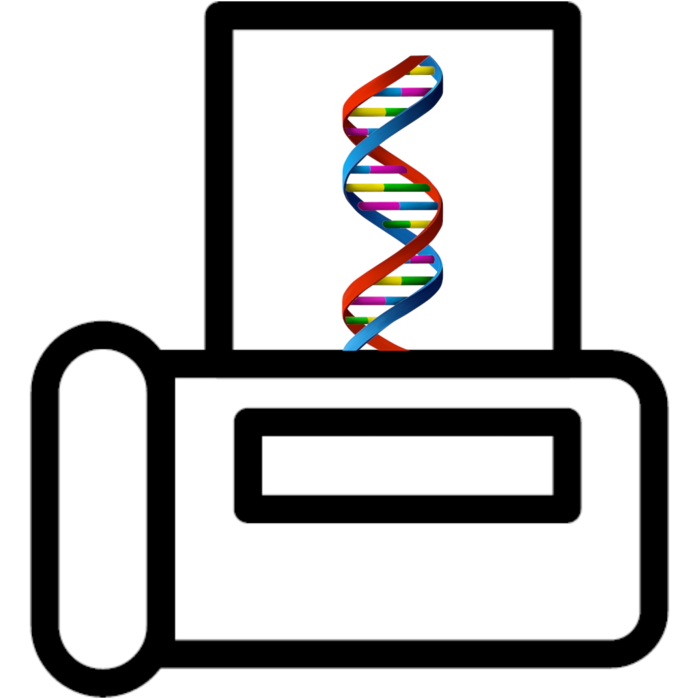

# vaximile



**Tumour neoantigen discovery from paired tumour/normal bulk DNA and tumour RNA sequencing.**

[](https://www.nextflow.io/)

vaximile takes a patient's tumour and matched normal exome or genome libraries plus tumour
RNA-seq and produces ranked neoantigen predictions, along with the evidence behind them:
somatic and germline variants, HLA genotypes and HLA loss of heterozygosity, allele-specific
copy number, expression, and fusions.

## Steps

**DNA preprocessing** — [fastp](https://github.com/OpenGene/fastp) trimming,
[minibwa](https://github.com/lh3/minibwa) alignment, duplicate marking and GATK base
recalibration, then `samtools` QC and [somalier](https://github.com/brentp/somalier)
relatedness checks to catch sample swaps.

**Somatic variant calling** — [Mutect2](https://gatk.broadinstitute.org),
[Strelka2](https://github.com/Illumina/strelka) with
[Manta](https://github.com/Illumina/manta), and
[DeepSomatic](https://github.com/google/deepsomatic). Each callset is filtered to `PASS`
and normalised, then combined on an **n−1 consensus**: a variant is kept when at least two
of the three callers report it.

**Germline variant calling** — GATK `HaplotypeCaller` with CNN scoring,
[Strelka2](https://github.com/Illumina/strelka) in germline mode, and
[DeepVariant](https://github.com/google/deepvariant), combined on the same 2-of-3 rule. The
consensus callset also drives proximal variant phasing for pVACseq.

**HLA typing** — [OptiType](https://github.com/FRED-2/OptiType) (class I) and
[HLA-HD](https://www.genome.med.kyoto-u.ac.jp/HLA-HD/) (class I and II) per library, whose
calls go to pVACtools, plus [mhcflow](https://github.com/svm-zhang/mhcflow), which types
each library against a sample-specific HLA reference for the LOH step.

**CNV** — [ASCAT](https://github.com/VanLoo-lab/ascat) allele-specific copy number, which
also supplies the tumour purity and ploidy the LOH step uses.

**HLA LOH** — each tumour is realigned against the HLA reference mhcflow inferred for *its
own normal*, and [lohhla-mod](https://github.com/svm-zhang/lohhla-mod) calls loss over the
pair.

**RNA alignment and quantification** — [STAR](https://github.com/alexdobin/STAR) alignment
and [salmon](https://combine-lab.github.io/salmon/) quantification at transcript and gene
level.

**RNA fusion calling** — [Arriba](https://github.com/suhrig/arriba) and
[STAR-Fusion](https://github.com/STAR-Fusion/STAR-Fusion).

**Neoantigen prediction** — [Ensembl VEP](https://www.ensembl.org/vep) annotation with DNA
and RNA coverage and expression, then [pVACseq](https://pvactools.readthedocs.io) on
somatic variants and pVACfuse on fusions.

**Report** — one [MultiQC](https://multiqc.info/) report per patient, including the HLA LOH
and ASCAT results.

## Parameters

### Input/output options

Define where the pipeline should find input data and save output data.

| Parameter | Description | Default |
| --------- | ----------- | ------- |
| `--samplesheet` | **Required.** Path to comma-separated file describing the patients, samples and FastQ files. | — |
| `--capture_kits` | **Required.** Path to comma-separated file mapping capture kit names to their BED target files. | — |
| `--vep_cache` | Path to a local Ensembl VEP cache directory. Optional; downloaded if omitted. | — |
| `--outdir` | **Required.** The output directory where the results will be saved. | `./vaximile_out` |

### Reference genome options

Reference genome, annotation and transcriptome files.

| Parameter | Description | Default |
| --------- | ----------- | ------- |
| `--reference_fa` | Reference genome FASTA. Gzipped input is decompressed and indexed automatically. | `https://ftp.ebi.ac.uk/pub/databases/gencode/Gencode_human/release_49/GRCh38.primary_assembly.genome.fa.gz` |
| `--reference_includes_chr_prefix` | Set to false when the reference contigs are named without a 'chr' prefix. | `true` |
| `--gtf` | Gene annotation GTF used for RNA alignment, quantification and fusion calling. | `https://ftp.ebi.ac.uk/pub/databases/gencode/Gencode_human/release_49/gencode.v49.annotation.gtf.gz` |
| `--transcriptome_reference` | Transcriptome FASTA used to build the salmon index. | `https://ftp.ensembl.org/pub/release-115/fasta/homo_sapiens/cdna/Homo_sapiens.GRCh38.cdna.all.fa.gz` |
| `--human_ref_peptides` | Reference proteome peptide FASTA used by pVACtools for reference proteome similarity. | `https://ftp.ensembl.org/pub/current_fasta/homo_sapiens/pep/Homo_sapiens.GRCh38.pep.all.fa.gz` |

### Alignment index options

Prebuilt indices. Any left unset are built from the reference during the run.

| Parameter | Description | Default |
| --------- | ----------- | ------- |
| `--bwa_index` | Directory containing a prebuilt minibwa index. | — |
| `--star_index` | Directory containing a prebuilt STAR 2.7.10 index. | — |
| `--salmon_index` | Directory containing a prebuilt salmon index. | — |

### Variant calling options

Interval scattering behaviour for the GATK-based callers.

| Parameter | Description | Default |
| --------- | ----------- | ------- |
| `--interval_padding` | Bases of padding added around each calling interval. | `100` |
| `--scatter_count` | Number of interval shards to scatter variant calling across. | `30` |

### HLA typing options

Reference data for MHC region extraction and HLA allele calling.

| Parameter | Description | Default |
| --------- | ----------- | ------- |
| `--hla_fasta` | HLA class I reference FASTA. | `https://raw.githubusercontent.com/jason-weirather/hla-polysolver/master/data/abc_complete.fasta` |
| `--hla_fasta_fai` | Index for the HLA reference FASTA. | `https://raw.githubusercontent.com/jason-weirather/hla-polysolver/master/data/abc_complete.fasta.fai` |
| `--hla_kmers` | Unique HLA k-mer file used by the typing tools. | `https://raw.githubusercontent.com/jason-weirather/hla-polysolver/master/data/abc_v14.uniq` |
| `--hla_freq` | HLA allele population frequency table. | `https://raw.githubusercontent.com/jason-weirather/hla-polysolver/master/data/HLA_FREQ.txt` |

### GATK resource bundle options

Known-sites VCFs used for BQSR, contamination estimation and somatic filtering. Each must have a matching .tbi.

| Parameter | Description | Default |
| --------- | ----------- | ------- |
| `--common_germline` | Common germline biallelic SNP sites for contamination estimation. | `gs://gatk-best-practices/somatic-hg38/small_exac_common_3.hg38.vcf.gz` |
| `--known_sites_dbsnp` | dbSNP known sites VCF for BQSR. | `gs://gcp-public-data--broad-references/hg38/v0/Homo_sapiens_assembly38.dbsnp138.vcf.gz` |
| `--known_sites_1000g_snps` | 1000 Genomes high-confidence SNPs for BQSR. | `gs://gcp-public-data--broad-references/hg38/v0/1000G_phase1.snps.high_confidence.hg38.vcf.gz` |
| `--known_indels` | Known indels VCF for BQSR. | `gs://gcp-public-data--broad-references/hg38/v0/Homo_sapiens_assembly38.known_indels.vcf.gz` |
| `--gnomad` | gnomAD allele-frequency-only VCF for Mutect2. | `gs://gatk-best-practices/somatic-hg38/af-only-gnomad.hg38.vcf.gz` |
| `--pon` | Panel of normals VCF for Mutect2. | `gs://gatk-best-practices/somatic-hg38/1000g_pon.hg38.vcf.gz` |
| `--hapmap` | HapMap VCF for germline variant recalibration. | `gs://gcp-public-data--broad-references/hg38/v0/hapmap_3.3.hg38.vcf.gz` |
| `--mills` | Mills gold standard indels VCF. | `gs://gcp-public-data--broad-references/hg38/v0/Mills_and_1000G_gold_standard.indels.hg38.vcf.gz` |
| `--somalier_sites` | Sites VCF used by somalier for relatedness checks. | `https://github.com/brentp/somalier/files/3412456/sites.hg38.vcf.gz` |

### Generic options

Less common options for the pipeline, typically set in a config file.

| Parameter | Description | Default |
| --------- | ----------- | ------- |
| `--publish_dir_mode` | Method used to save pipeline results to output directory. | `copy` |
| `--version` | Display version and exit. | `false` |
| `--help` | Display help text. | `false` |

### Samplesheet 
One sample per line. A complete somatic grouping consists of a tumor sample, normal sample, and a tumor RNA sample.

- **`patient`** — identifies a shared patient field that can contain multiple somatic groups. The pipeline concludes with a patient-level MultiQc reports with all patient-specific sample metrics.

- **`somatic_name`** — identifies the somatic comparison being done. Each somatic_name should have a single tumor dna sample, normal dna sample, and tumor RNAseq. In the case that multiple tumor samples share one normal sample, the normal sample will still need its own line in the samplesheet.

- **`sample_name`** — name of the individual sample.

- **`sample_type`** — either Tumor or Normal.

- **`sequencing_type`** — one of: exome, genome, rna, exome_FFPE, genome_FFPE.

- **`sex`** — either XX, XY, or left blank. Used only when running ASCAT.

- **`capture_kit`** — name of the capture kit used. Must match a kit name in the capture_kits.csv. Left blank by RNA samples.

- **`fastqr{1.2}`** — R1 and R2 fastqs for the sample

#### Example:

`samplesheet.csv`

| patient  | somatic_name   | sample_name | sample_type | sequencing_type | sex | capture_kit | fastqr1         | fastqr2         |
| -------- | -------------- | ----------- | ----------- | --------------- | --- | ----------- | --------------- | --------------- |
| PatientX | PatientX_T1_N1 | Tumor1      | Tumor       | exome           | XX  | twist_2     | t1_r1.fq.gz     | t1_r2.fq.gz     |
| PatientX | PatientX_T1_N1 | Normal1     | Normal      | exome           | XX  | twist_2     | n1_r1.fq.gz     | n1_r2.fq.gz     |
| PatientX | PatientX_T1_N1 | Tumor1      | Tumor       | rna             | XX  |             | t1_rna_r1.fq.gz | t1_rna_r2.fq.gz |

`capture_kits.csv`

| kit     | bed                             |
| ------- | ------------------------------- |
| twist_2 | /beds/TwistExome_GRCh38_chr.bed |

```bash
nextflow run . -profile singularity,conda --samplesheet ./samplesheet.csv --capture_kits ./capture_kits.csv --outdir ./vaximile_out -resume
```
Some modules are container-only while others are conda-only. To execute a full run without problems, both will need to be enabled.


## Output

Publishing is driven by the `output {}` block in `main.nf`, which nests results under
`<outdir>/<patient>/<somatic_name>/`.

### Directory structure

```text
<outdir>/
└── <patient>/
    ├── multiqc/
    │   └── <patient>_report.html
    ├── pvactools_report/
    │   └── combined MHC class I aggregated report across the patient's pairs
    ├── <somatic_name>/          one directory per tumour/normal pair
    │   ├── variants/     somatic VCF (+ index) and its tabular form
    │   ├── hla/
    │   │   ├── pVACtools-formatted allele list for the pair
    │   │   └── loh/      lohhlamod LOH results and per-gene plots, and the ASCAT
    │   │                 result set whose purity and ploidy they are built on
    │   └── pvactools/    pVACseq and pVACfuse prediction directories
    └── samples/                 everything belonging to a single library
        └── <sample_name>/
            ├── alignment/ duplicate-marked BAM, recalibrated BAM, STAR BAM (+ indexes)
            ├── germline/  germline VCF (+ index) and its tabular form, normals only
            ├── hla/
            │   ├── optitype/ class I calls and coverage plot
            │   ├── hlahd/    class I and II calls
            │   └── pVACtools-formatted allele list
            └── salmon/    gene-level abundance, RNA samples only
```

Outputs split by whether they belong to a pair or to a single library. Pair directories sit
directly under the patient; per-library results are collected under `samples/` so they do
not interleave with them.

A library shared between pairs - a normal used as the control for several tumours - is
processed once, so its alignments, germline calls and per-sample HLA typing appear once
under `samples/` rather than being duplicated beneath each pair.

### Results by stage

#### Quality control

`multiqc/<patient>_report.html` aggregates, per patient: fastp reports for every DNA and
RNA library, GATK base recalibration tables, samtools flagstat/coverage/idxstats, STAR
alignment logs, salmon quantification summaries, OptiType and HLA-HD calls, VEP summaries
for both germline and somatic annotation, and somalier relatedness tables.

The somalier pairs/samples tables in that report are the check for sample swaps — confirm
the tumour and normal of each pair relate to each other before trusting downstream calls.

#### Variant calling

`variants/` holds the merged, filtered and annotated somatic callset. Three callers
contribute: Mutect2, Strelka2 (with Manta for indel candidates) and DeepSomatic. Each is
filtered to `PASS` and normalised, then combined with GATK3 `CombineVariants` under
`--minimumN 2` - an **n-1 consensus**, so a variant is kept when at least two of the three
callers report it. The published VCF is therefore a consensus product rather than any
single caller's raw output. The `.tsv` alongside it is the same content flattened for
spreadsheet use.

`germline/` holds the consensus germline callset for the normal sample, built the same way
from three callers: GATK `HaplotypeCaller` (CNN-scored and tranche-filtered), Strelka2 in
germline mode, and DeepVariant, combined under the same 2-of-3 rule. This VCF is also the
phasing input for proximal variant detection in pVACseq.

#### HLA typing

Class I alleles come from OptiType, class I and II from HLA-HD, both run per library. The
normal's calls are what feed pVACtools, since HLA type is germline.

#### HLA loss of heterozygosity

`hla/loh/` holds the lohhlamod result table for the pair - per-allele copy number, the
mismatch logR p-value and BAF - alongside per-gene coverage, logR and BAF plots, and the
ASCAT result set the copy number inference is built on. The tumour
is realigned against the HLA reference mhcflow inferred for its own normal, so the two BAMs
sit on one subject-specific reference.

#### Neoantigen prediction

`pvactools/` contains the pVACseq output for somatic variants and the pVACfuse output for
RNA fusions called by Arriba and STAR-Fusion. `<patient>/pvactools_report/` is the
aggregated MHC class I report combined across the patient's tumour/normal pairs.

#### Expression

`salmon/` publishes `quant.genes.sf`, the gene-level TPM table salmon aggregates from
`--geneMap`. The transcript-level `quant.sf` and the rest of the salmon run directory are
produced but consumed internally - for VCF expression annotation, strandedness prediction
and MultiQC - rather than published.

#### Alignments

`alignment/` holds three BAMs per library, each with its index, distinguished by suffix:
`_markdup.bam` after duplicate marking, `_bqsr.bam` after base recalibration, and
`_STAR_sorted.bam` for RNA. The somatic callers read the recalibrated BAMs; Strelka and
Manta read the duplicate-marked ones.

#### Copy number

`hla/loh/` publishes the whole ASCAT result set for a pair - segments, CNV calls,
purity/ploidy estimates, BAF and LogR tables, run metrics and plots. It sits with the LOH
results because its purity and ploidy are what that copy number inference uses, and the two
are read together.

### Not published by default

Per-caller intermediate VCFs, aligned BAMs, RNA fusion tables and
the built alignment indices remain in the work directory. Add them to the `publish:` block
in `main.nf` and give them a `path {}` in the `output {}` block to change that.

## Credits

vaximile is developed by Harrison Wismer at UCSF.

## Citations

### [Nextflow](https://pubmed.ncbi.nlm.nih.gov/28398311/)

> Di Tommaso P, Chatzou M, Floden EW, Barja PP, Palumbo E, Notredame C. Nextflow enables reproducible computational workflows. Nat Biotechnol. 2017 Apr 11;35(4):316-319. doi: 10.1038/nbt.3820.

### [nf-core](https://pubmed.ncbi.nlm.nih.gov/32055031/)

> Ewels PA, Peltzer A, Fillinger S, Patel H, Alneberg J, Wilm A, Garcia MU, Di Tommaso P, Nahnsen S. The nf-core framework for community-curated bioinformatics pipelines. Nat Biotechnol. 2020 Mar;38(3):276-278. doi: 10.1038/s41587-020-0439-x.

### Pipeline tools

#### Quality control and reporting

- [fastp](https://pubmed.ncbi.nlm.nih.gov/30423086/) — Chen S, Zhou Y, Chen Y, Gu J. fastp: an ultra-fast all-in-one FASTQ preprocessor. Bioinformatics. 2018;34(17):i884-i890.
- [MultiQC](https://pubmed.ncbi.nlm.nih.gov/27312411/) — Ewels P, Magnusson M, Lundin S, Käller M. MultiQC: summarize analysis results for multiple tools and samples in a single report. Bioinformatics. 2016;32(19):3047-8.
- [SAMtools](https://pubmed.ncbi.nlm.nih.gov/19505943/) — Li H, Handsaker B, Wysoker A, et al. The Sequence Alignment/Map format and SAMtools. Bioinformatics. 2009;25(16):2078-9.
- [somalier](https://pubmed.ncbi.nlm.nih.gov/32664994/) — Pedersen BS, Bhetariya PJ, Brown J, et al. Somalier: rapid relatedness estimation for cancer and germline studies using efficient genotype sketches. Genome Med. 2020;12(1):62.

#### Alignment and pre-processing

- [Minibwa](https://arxiv.org/abs/2606.15357) — Li H, Homer N. Fast genomic read alignment with minibwa. arXiv:2606.15357. 2026.
- [GATK](https://pubmed.ncbi.nlm.nih.gov/20644199/) — McKenna A, Hanna M, Banks E, et al. The Genome Analysis Toolkit: a MapReduce framework for analyzing next-generation DNA sequencing data. Genome Res. 2010;20(9):1297-303.

#### Somatic and germline variant calling

- [Mutect2](https://www.biorxiv.org/content/10.1101/861054v1) — Benjamin D, Sato T, Cibulskis K, et al. Calling Somatic SNVs and Indels with Mutect2. bioRxiv. 2019.
- [Strelka2](https://pubmed.ncbi.nlm.nih.gov/30013048/) — Kim S, Scheffler K, Halpern AL, et al. Strelka2: fast and accurate calling of germline and somatic variants. Nat Methods. 2018;15(8):591-594.
- [Manta](https://pubmed.ncbi.nlm.nih.gov/26647377/) — Chen X, Schulz-Trieglaff O, Shaw R, et al. Manta: rapid detection of structural variants and indels for germline and cancer sequencing applications. Bioinformatics. 2016;32(8):1220-2.
- [DeepVariant](https://pubmed.ncbi.nlm.nih.gov/30247488/) — Poplin R, Chang PC, Alexander D, et al. A universal SNP and small-indel variant caller using deep neural networks. Nat Biotechnol. 2018;36(10):983-987.
- [DeepSomatic](https://www.biorxiv.org/content/10.1101/2024.08.16.608331v1) — Park J, Cook DE, Chang PC, et al. DeepSomatic: Accurate somatic small variant discovery for multiple sequencing technologies. bioRxiv. 2024.

#### Annotation and copy number

- [Ensembl VEP](https://pubmed.ncbi.nlm.nih.gov/27268795/) — McLaren W, Gil L, Hunt SE, et al. The Ensembl Variant Effect Predictor. Genome Biol. 2016;17(1):122.
- bam-readcount — Khanna A, Larson DE, Srivatsan SN, et al. Bam-readcount - rapid generation of basepair-resolution sequence metrics. J Open Source Softw. 2022;7(69):3722.
- [ASCAT](https://pubmed.ncbi.nlm.nih.gov/20837533/) — Van Loo P, Nordgard SH, Lingjærde OC, et al. Allele-specific copy number analysis of tumors. Proc Natl Acad Sci USA. 2010;107(39):16910-5.

#### HLA typing

- [OptiType](https://pubmed.ncbi.nlm.nih.gov/25143287/) — Szolek A, Schubert B, Mohr C, et al. OptiType: precision HLA typing from next-generation sequencing data. Bioinformatics. 2014;30(23):3310-6.
- [HLA-HD](https://pubmed.ncbi.nlm.nih.gov/28419628/) — Kawaguchi S, Higasa K, Shimizu M, Yamada R, Matsuda F. HLA-HD: An accurate HLA typing algorithm for next-generation sequencing data. Hum Mutat. 2017;38(7):788-797.

#### RNA quantification and fusion calling

- [STAR](https://pubmed.ncbi.nlm.nih.gov/23104886/) — Dobin A, Davis CA, Schlesinger F, et al. STAR: ultrafast universal RNA-seq aligner. Bioinformatics. 2013;29(1):15-21.
- [salmon](https://pubmed.ncbi.nlm.nih.gov/28263959/) — Patro R, Duggal G, Love MI, Irizarry RA, Kingsford C. Salmon provides fast and bias-aware quantification of transcript expression. Nat Methods. 2017;14(4):417-419.
- [Arriba](https://pubmed.ncbi.nlm.nih.gov/33500328/) — Uhrig S, Ellermann J, Walther T, et al. Accurate and efficient detection of gene fusions from RNA sequencing data. Genome Res. 2021;31(3):448-460.
- [STAR-Fusion](https://www.biorxiv.org/content/10.1101/120295v1) — Haas BJ, Dobin A, Stransky N, et al. STAR-Fusion: Fast and Accurate Fusion Transcript Detection from RNA-Seq. bioRxiv. 2017.

#### Neoantigen prediction

- [pVACtools](https://pubmed.ncbi.nlm.nih.gov/31907209/) — Hundal J, Kiwala S, McMichael J, et al. pVACtools: A Computational Toolkit to Identify and Visualize Cancer Neoantigens. Cancer Immunol Res. 2020;8(3):409-420.

#### Software packaging and containerisation

- [Anaconda](https://anaconda.com) — Anaconda Software Distribution. Computer software. Vers. 2-2.4.0. Anaconda, Nov. 2016.
- [Bioconda](https://pubmed.ncbi.nlm.nih.gov/29967506/) — Grüning B, Dale R, Sjödin A, et al. Bioconda: sustainable and comprehensive software distribution for the life sciences. Nat Methods. 2018;15(7):475-476.
- [BioContainers](https://pubmed.ncbi.nlm.nih.gov/28379341/) — da Veiga Leprevost F, Grüning B, Alves Aflitos S, et al. BioContainers: an open-source and community-driven framework for software standardization. Bioinformatics. 2017;33(16):2580-2582.
- [Docker](https://dl.acm.org/doi/10.5555/2600239.2600241) — Merkel D. Docker: lightweight Linux containers for consistent development and deployment. Linux Journal. 2014;2014(239):2.
- [Singularity](https://pubmed.ncbi.nlm.nih.gov/28494014/) — Kurtzer GM, Sochat V, Bauer MW. Singularity: Scientific containers for mobility of compute. PLoS One. 2017;12(5):e0177459.
